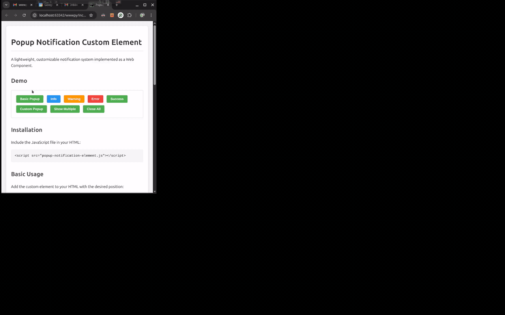
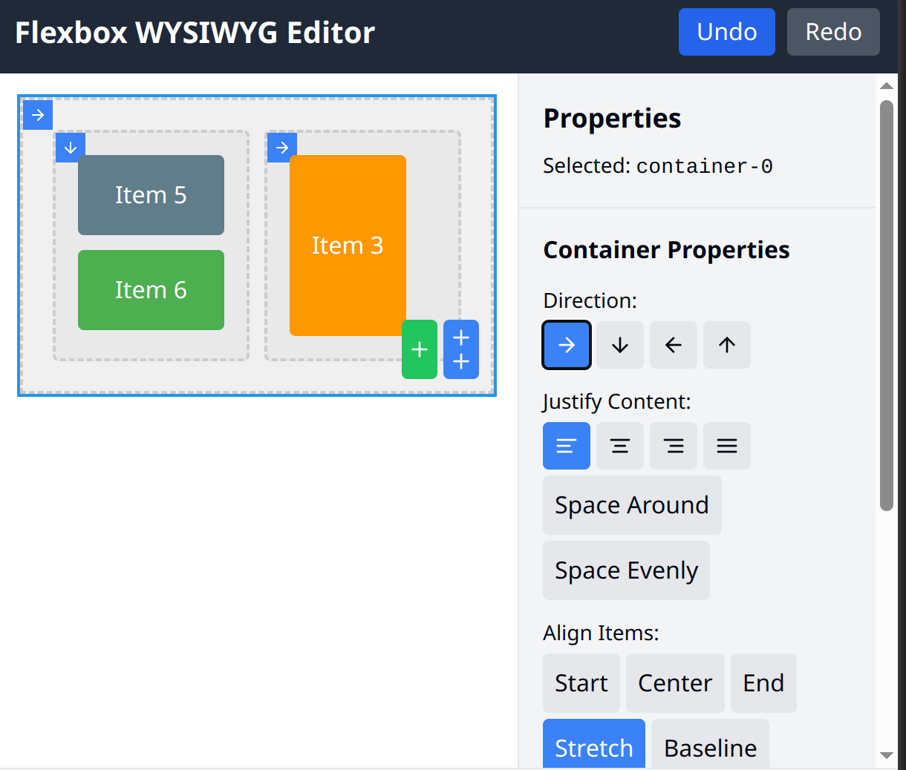

Title: Week 17 plan
Date: 2025-04-21
Category: Weekly planning

Ciao Max, Fabrizio e Lorenzo,

## **Resoconto settimana 15 e 16**

Ho continuato a concentrarmi sulle funzionalita' core di wwwpy.

Sto impostando una struttura che permetta una migliore estensibilità e manutenibilità;

Quindi sono andato a copiare le metodologie di Jetbrains; che, nella mia opinione, sono i leader. Anche Visual Studio Code potrebbe essere fonte di ispirazione.

La parte su cui sto battendo e' lo sviluppo con test della toolbar/palette.

Di seguito elenco alcune parti che ho aggiunto in concreto:

- Un bus per gli eventi, non l'avevo ancora introdotto ed era una cosa dovuta da tempo. Studiando IDEA di JetBrains ho visto che e' un componente fondamentale che anche loro usano
- Dependency injector; ho creato una libreria basica per gli stessi motivi del punto precedente.
- Prototipo per un layout system (vedi screenshot sotto)
- Prototipo per un sistema di notifiche con popup (vedi gif animata sotto)

Tutto quello che sto facendo e' coperto per la maggior parte da test: questa cosa e' imprescindibile. La toolbox precedente non aveva test ed e' diventata "intoccabile"; cioe' appena la tocco rompo qualcos'altro.

Mentre sviluppavo ho trovato alcuni buggettini qua e là (parser html) pero' la cosa e' stata semplice da sistemare perche' avendo gia' tutto sotto test, ho potuto aggiungere il caso d'uso che innescava il bug e ho potuto correggere rapidamente.

## **Pianificazione settimana 17**

In questa settimana continuo lo sviluppo sulle funzionalita' core

- Devo sviluppare il meccanismo della palette in modo che sia estendibile e offra degli hook point (come fanno quelli di JetBrains)
- Voglio gia' pensare nel design la multi selezione (cioe' avere piu' di un elemento selezionato, anziche' solo uno)
- Presto ci sara' una bar appena sotto l'elemento selezionato e implementero' il cancella

## **Obiettivo trimestrale**

L'obiettivo di questo trimestre e' Invariato.

*Acquire users: Make 1 person happy*

Cosa vuol dire? All'atto pratico lo traduco nei seguenti passi:

- connessione al database e databinding (principale)
- migliorare la toolbox (selezione, elimina, custom elements in palette, new component dialog, pulizia eccesso di componenti, aggiungere icone)
- implementare un layout system con flex

Fatemi sapere se avete commenti o domande.

ciao e grazie
Simone

Notification system

Alcuni test per creare un sistema semplice di layout
