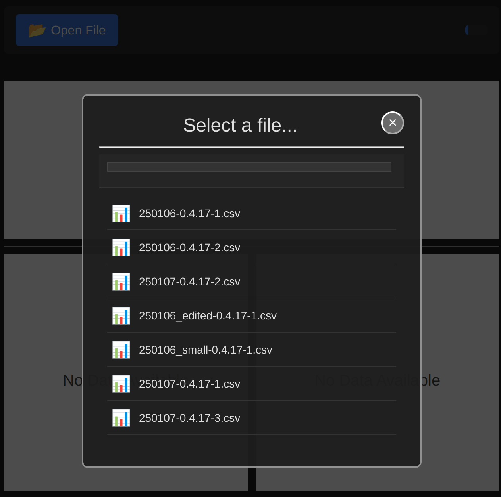

Title: Week 14 plan
Date: 2025-03-31
Category: Weekly planning

Ciao Max, Fabrizio e Lorenzo,

## **Resoconto settimana 13**

Come vi dicevo settimana scorsa ho dato massima priorità a Lorenzo e alla visual-app.

Le funzionalita' sviluppate sono:

- File browser per selezionare un file csv
- Gestione dei dialog per mettere a schermo del contenuto
- Aggiunta gestione delle hotkey (shortcuts)

Nell'ultima riunione con un cliente americano abbiamo fatto una piccola demo della visual-app. La cosa e' andata bene.

Nel frattempo ho anche fatto alcune migliorie a wwwpy stesso:

- Migliorato il log (ho aggiunto nella console due icone perche' sia evidente se il log arriva la server o dal remote)
- Migliorati dei messaggi di errore che si presentano in certe situazioni con l'hot reload

## **Obiettivo trimestrale**

L'obiettivo di questo trimestre, 'make 1 person happy', e' stato raggiunto :) Grazie a Lorenzo che ha dato fiducia a wwwpy.

Quindi, l'obiettivo del secondo trimestre e'.

*Acquire users: Make 1 person happy*

Cosa vuol dire? All'atto pratico lo traduco nei seguenti passi:

- connessione al database e databinding (principale)
- migliorare la toolbox (selezione, elimina, custom elements in palette, new component dialog, pulizia eccesso di componenti, aggiungere icone)
- implementare un layout system con flex

## **Pianificazione settimana 14**

Il database e databinding e' l'obiettivo principale. Ad ogni modo devo migliorare l'usabilita' e le funzionalita' di wwwpy stesso per poter sviluppare meglio io medesimo.

Quindi la settimana prossima inizio da uno di questi punti:

- migliorare la toolbox
- terminare l'rpc (il websocket deve essere ancora fatto)
- splittare la remote site-packages per migliorare l'hot reload

Fatemi sapere se avete commenti o domande.

ciao e grazie
Simone

