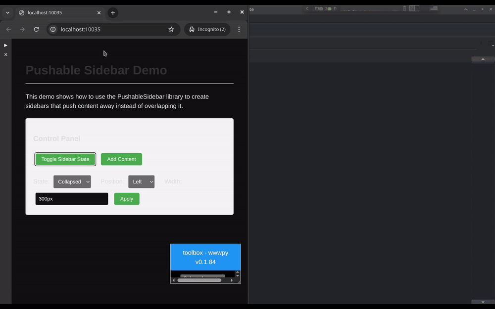
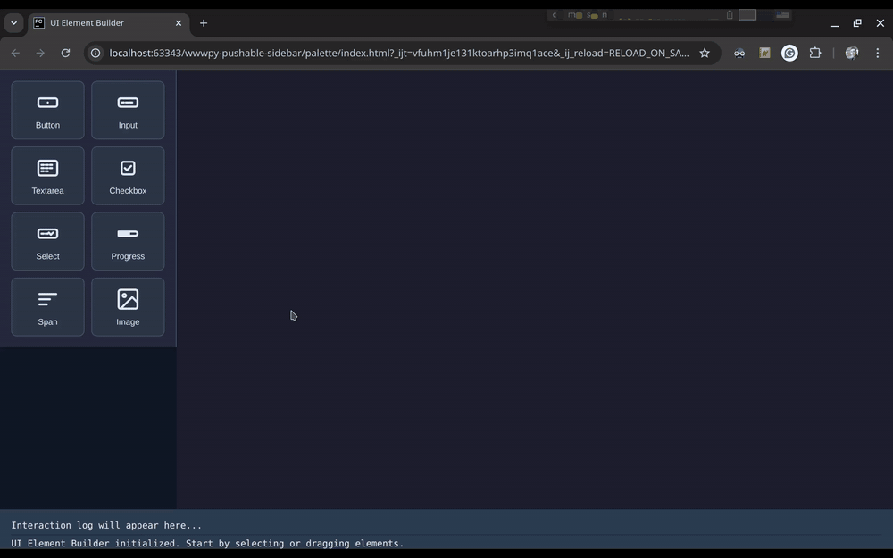
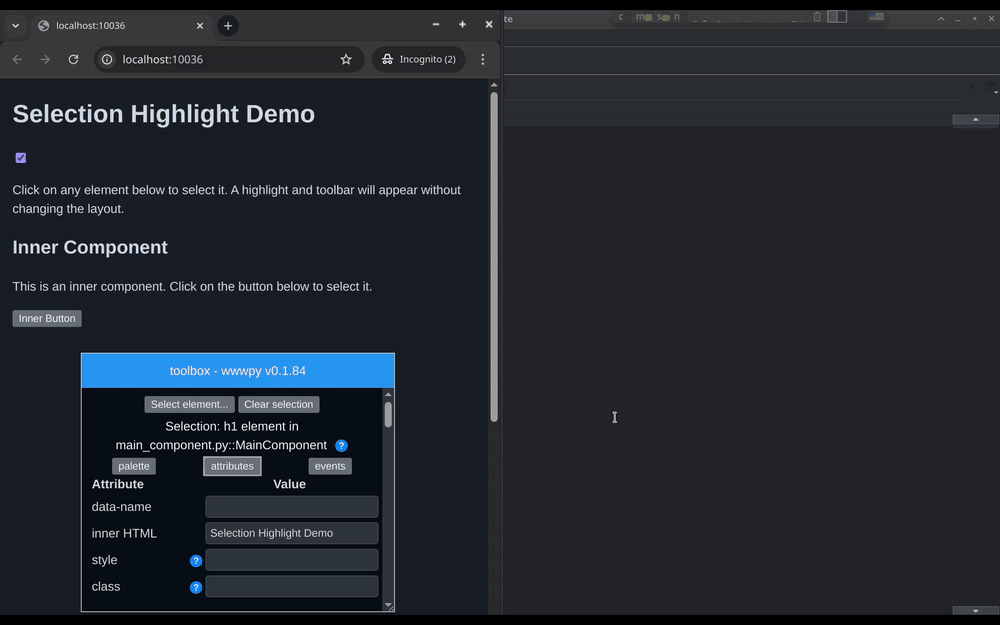

Title: Week 15 plan
Date: 2025-04-07
Category: Weekly planning

Ciao Max, Fabrizio e Lorenzo,

## **Resoconto settimana 14**

Settimana scorsa mi sono concentrato sulle funzionalita' core di wwwpy.

Ho prototipato varie cose:

- Una nuova finestra laterale per presentare i componenti (palette) che funziona con il drag & drop e ha icone per indicare di che componente si parla
- Un nuovo modo di evidenziare la selezione degli elementi
- Una piccola toolbar sotto l'elemento selezionato per avere azioni contestuali all'elemento (elimina, visualizza eventi/proprieta', rinomina etc)

**Sto sviluppando tutto con test perche' il problema della precedente toolbox era esattamente questo: non era manutenibile e si rompeva troppo facilmente.**

Vedi sotto degli screenshot (considerate che sono mockup e devo ancora integrarli)

## **Pianificazione settimana 15**

In questa settimana continuo lo sviluppo sulle funzionalita' core

- Mi focalizzo interamente sulla nuova finestra laterale (palette)
- Terminata la palette andro' a sviluppare la nuova metodologia per selezionare gli elementi e la bar delle azioni contestuali

## **Obiettivo trimestrale**

L'obiettivo di questo trimestre e' Invariato.

*Acquire users: Make 1 person happy*

Cosa vuol dire? All'atto pratico lo traduco nei seguenti passi:

- connessione al database e databinding (principale)
- migliorare la toolbox (selezione, elimina, custom elements in palette, new component dialog, pulizia eccesso di componenti, aggiungere icone)
- implementare un layout system con flex

Fatemi sapere se avete commenti o domande.

ciao e grazie
Simone

