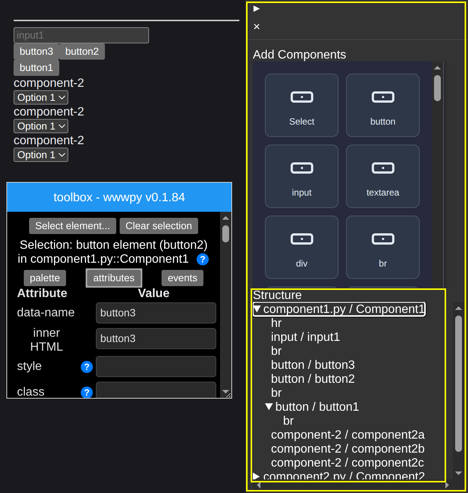

Title: Week 22 plan
Date: 2025-05-26
Category: Weekly planning

Ciao Max, Fabrizio e Lorenzo,

Max mi ha fatto un commento in relazione a quali features ho pianificato per lo sviluppo che mi bloccano per dare wwwpy in mano agli utenti; la risposta e' che non ho fatto ancora una tale definizione. Quindi la struttura di questa email sara' leggermente differente dal solito per iniziare a rispondere a quella domanda.

In piu' ho realizzato che voglio tornare ad investire tempo e risorse nella comunicazione (blog post, newsletter, etc.) e sotto condivido alcune riflessioni anche su questo.

## **Features e sviluppo**

Divido in due le aree di sviluppo: funzionalita' core e funzionalita' non core

**Funzionalità core**:

- Sidebar (vedi screenshot sotto) questo implica una rifattorizzazione di quello che c'e' per renderla piu' leggera e versatile.
- Structure tree (vedi lo stesso screenshot sotto): mostra la struttura ad albero dei componenti creati dall'utente e permette l'interazione con essi.
- Tree component; componente UI base su cui si appoggia il punto precedente.
- StripeBar; componente UI base che verra' usato da tutti i punti precedenti.

**Funzionalità non core**:

- Layout system; questo permettera' all'utente di organizzare la UI in modo semplice e rapido.
- Database e databinding; argomento grande che non approfondiro' adesso.

## **Comunicazione**

Pensavo di trasformare questo resoconto settimanale in un blog post online (o qualcosa del genere).

In questo modo creo una 'storia' che chiunque puo' leggere liberamente online.

Pensavo poi di pubblicare una newsletter o un post su Reddit con frequenza mensile o bimensile per dare una sintesi di cio' che e' successo.

## **Resoconto settimana 21**

Ecco i punti su cui ho lavorato:

- Inizio sviluppo ComponentTree (che dovro' rinominare StructureTree per chiarezza)
- Sistemate alcune situazioni dove aggiungere un componente dava errore (argomento beforebegin, afterbegin, beforeend, afterend)
- Investigato e fix parziale di memory leak su Component
- Rifattorizzazione e pulizia dell'interazione tra l'IntentManager e la catena a valle (SelectElementIntent e AddElementIntent). Sto spendendo un po' di tempo su questo tema per dare una struttura razionale alle api.

## **Pianificazione settimana 22**

In questa settimana:

- Dedico una mattina (mercoledi) per iniziare a convertire le precedenti email di pianificazione in un blog post
- Continuo lo sviluppo/pulizia dell'IntentManager; questo mi permettera' di organizzare bene l'interazione con i vari StructureComponent, PaletteComponent e Sidebar
- Proseguo lo sviluppo su StructureComponent (per adesso non credo di creare un componente separato di base TreeComponent)

## **Obiettivo trimestrale**

L'obiettivo di questo trimestre e' Invariato.

*Acquire users: Make 1 person happy*

Cosa vuol dire? All'atto pratico lo traduco nei seguenti passi:

- connessione al database e databinding (principale)
- migliorare la toolbox (selezione, elimina, custom elements in palette, new component dialog, pulizia eccesso di componenti, aggiungere icone)
- implementare un layout system con flex

Fatemi sapere se avete commenti o domande.

ciao e grazie
Simone

Sulla dx il prototipo sidebar e all'interno in basso il 'component structure'

